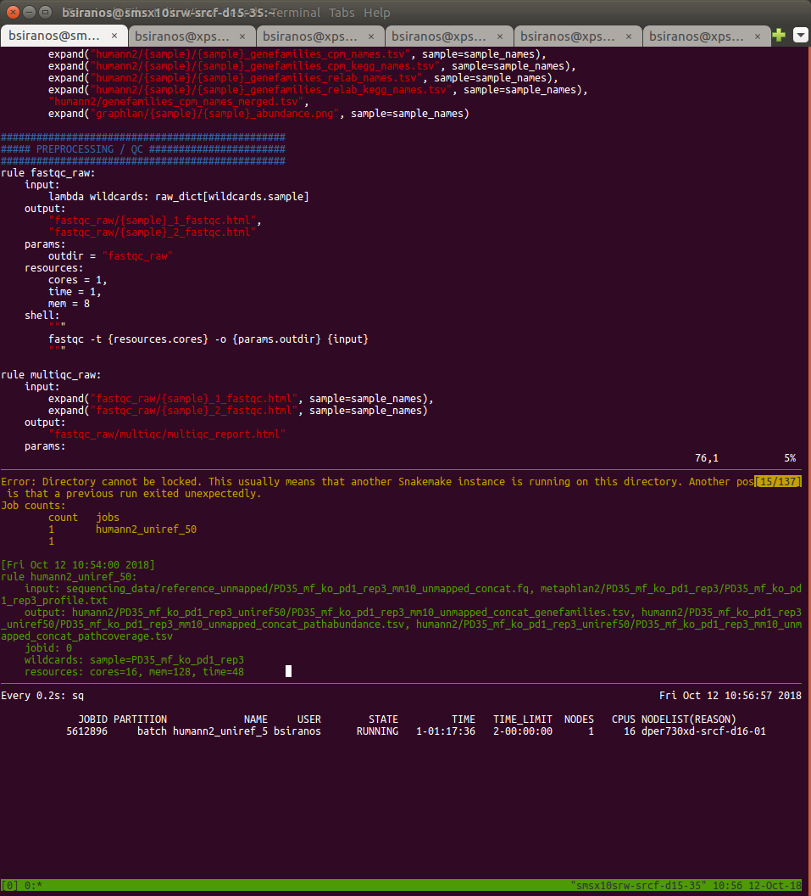

# scg_tools

Useful utilities and some collected knowledge for using the Stanford SCG cluster.

## Utilities
*ssub*: submit jobs  
*inter*: launch interactive sessions  
*check*: check the status of your jobs  
*cost*: your charges over the past day, week, month and year  
*lab_cost*: the charges for our top users over the past week  
*top_users*: the hall of fame.  Top users in terms of cpu-minutes over the past day.  

## Costs  
https://drive.google.com/file/d/1KGMNjtvN9BPkmpw7vVjCKbekTIE70E0M/view

## Storage
These graphs are made with graphite, which is accessible from the Stanford private network at https://graphite.scg.stanford.edu. Navigating there directly instead of using the links below will show an interface used to build these plots.

Individual footprints  
http://graphite.scg.stanford.edu/S/N

Collective footprint  
http://graphite.scg.stanford.edu/S/V

## Notes

### Compute usage

*labstats*: display compute usage by you and other members of your account.  Presently high by a factor of 2 due to some hyperthreading accounting issue.

The charges you accrue by running jobs on the cluster is a function of (elapsed walltime) * (allocated cores). Memory is not considered in determining cost. If you allocate eight cores, your job will cost eight times as much as a job with a single core allocated.  This is true regardless of whether your job is actually using all the cores!  It is therefore important to use your cpu allocation efficiently.  

# Intro to cluster computing

Please note that everything described here is described more comprehensively elsewhere!  Always read the documentation and/or publications for the tools you use.  Sacrifices in accuracy and thoroughness are made in the interest of basic conceptual scaffolding.

### The cluster

A compute cluster consists of one or more login nodes and many worker nodes.  In order to use a cluster, you establish a connection from your computer (e.g. `ssh johndoe@login.scg.stanford.edu`) through which you interact with a login node.  From there, you can see the cluster's filesystem and submit jobs for execution by worker nodes.  This can be done by the `ssub` and `inter` wrappers in the scg_tools repository, for submitted and interactive jobs, respectively.  The tools themselves will explain the options available when invoked with `-h`.  Anything more computationally taxing than filesystem navigation and the like should not be done on the login node.

### Doing stuff

There is an ongoing effort in the lab to codify analytical processes in snakemake workflows.  [Snakemake](https://snakemake.readthedocs.io/en/stable/index.html) is a python tool which automates workflow management.  These workflows can be found in the github bhattlab organization.  Snakemake can interpret a collection of rules, each with defined input and output, and link them together to obtain some final output (e.g. a barplot) from some initial input (e.g. raw read data).  Snakemake can also use the cluster, submitting the tasks associated with individual rules for execution on worker nodes.  This is achieved by following the instructions in the [slurm](https://www.github.com/bhattlab/slurm) repository.

### Getting started

*A natural tendency is to do things forever in the first way that worked. Resist this tendency and you will save a lot of time and frustration.*

#### SSH connection to the cluster

In OSX, we use the Terminal application to use the cluster.  In Windows, Cygwin works.  To access the cluster, simply `ssh <your sunetid>@login.scg.stanford.edu` and authenticate.  To avoid the need to authenticate multiple times per day, you can set up a master connection by writing the following to `.ssh/config` on your local machine, after which you can `ssh scg` one time, then connect normally as above without having to authenticate.

```
Host scg
  HostName login.scg.stanford.edu
  User yoursunetid
  PubkeyAuthentication no
  ControlMaster yes
  ControlPath ~/.ssh/sockets/scg
  ControlPersist 10

Host login.scg.stanford.edu
  HostName login.scg.stanford.edu
  User yoursunetid
  PubkeyAuthentication no
  ControlMaster no
  ControlPath ~/.ssh/sockets/scg
```

#### Filesystem access to the cluster

The files you work with--sequence data, alignments, reference genomes and so on--reside on the cluster, and should never be stored on your computer (i.e. "locally"). Beyond security reasons, this is simply for efficiency and simplicity; your computer is small, slow, and isolated, so should only be used as an interface to connect to the cluster.  However, it is frequently convenient to be able to open files with programs running on your computer, or exchange small items back and forth (like plots or what have you).  For this reason, it is useful to "mount" the cluster's filesystem on your computer--almost as though it were a huge USB flash drive.  This allows you to navigate the cluster's filesystem as though it were on your computer, viewing and manipulating files from the cluster as though they were local.

 1) Download and install [fuse](https://github.com/osxfuse/osxfuse/releases/download/osxfuse-3.8.2/osxfuse-3.8.2.dmg) and [sshfs](https://github.com/osxfuse/sshfs/releases/download/osxfuse-sshfs-2.5.0/sshfs-2.5.0.pkg).
 2) Open Terminal and enter the following, replacing your sunetid where appropriate:

```
mkdir ~/scg4
echo 'alias sf="diskutil unmount force ~/scg4_home; sshfs -o follow_symlinks YOURSUNETID@login.scg.stanford.edu:/labs/asbhatt/ ~/scg4"' >> ~/.profile
source ~/.profile
```

Now you can use the command `sf` to mount SCG on your local filesystem.  It will appear in the folder scg4 in your home directory.


#### Setting up your environment with Conda

An executable is a text file containing code, or a binary file (i.e. non-text and unreadable to humans) which performs some task. Any command resides somewhere on disk as an executable file. An executable may draw upon other executables, or libraries, collections of code which cannot be independently run, in order to function. Your environment refers in part to the collection of executables and libraries which you have available.  

The most straightforward method to setting up your environment is with Conda. This started as an environment and package manager for the Python programming language, but has since grown to cover packages (groups of libraries, executables and other code) for many other languages as well.  This greatly simplifies access to bioinformatic tools, as there are a huge number of packages available which Conda can install automatically. To set it up, do the following:

```
cd /labs/asbhatt/
mkdir -p <yourfoldername>/tools
cd <yourfoldername>/tools
wget https://repo.continuum.io/miniconda/Miniconda3-latest-Linux-x86_64.sh
chmod u+x ./Miniconda3-latest-Linux-x86_64.sh
./Miniconda3-latest-Linux-x86_64.sh
#it will be necessary to answer some prompts. Just hit enter or type yes. To exit the license agreement type :q
```

Once you have done this, you have access to your very own copy of Python, together with its package manager, Conda.  Verify that you are using the correct version of Python and Conda with the following:

```
which python
which conda
```

This should verify that you are running executables located in your lab directory.

Conda can now be used to install tools into the default environment, e.g. `conda install numpy`, which installs the NumPy library, providing Python with a large collection of functions and data structures which are useful for data analysis.  Some packages are on different "channels," or collections of packages.  A great many which are relevant to bioinformatics are found in the Bioconda channel.  An example of an installation of one of these: `conda install -c bioconda samtools`.  This installs the samtools tool from the Bioconda channel of the Anaconda cloud (yay conceptual scaffolding).  You can view details pertaining to this package, or search for others, at the [Anaconda](https://anaconda.org/bioconda/samtools) website.  

In addition to using Conda to install stuff into the default environment, you can also set up alternate environments.  These contain entirely parallel copies of everything managed by Conda, including Python, all its libraries, and all other packages Conda manages. Different environments can contain different sets of tools.  This is useful when you want to quickly set up to run a workflow with a long list of dependencies.  Here are a couple scenarios to explain the power of environment management.

 1) Peter needs samtools.  He uses `conda install samtools` in his default environment and receives an error.  Realizing that samtools is located in the Bioconda channel, he retries this with `conda install -c bioconda samtools` and is on his merry way.

 2) Samantha needs to use Snakemake to run a workflow.  She uses `conda install -c bioconda snakemake` and is dismayed to find that it requires Python 3.6, and her default environment contains Python 2.7.  In order to run Snakemake, she creates an environment with Python 3.6 with `conda create -n snakemake_environment python=3.6`, then enters it with `source activate snakemake_environment` and finally installs Snakemake into her new environment with her original command.  Samantha has made life difficult for herself--she could have simply used `conda create -n snakemake_environment -c bioconda snakemake` followed by `source activate snakemake` and saved herself a second or two.

 3) Ian would like to run a workflow.  The workflow uses several standalone tools, and several scripts utilizing libraries in R and Python.  In order to run this workflow he must first install its dependencies, which are helpfully written into a `environment.yaml` file that came with the workflow repository (see the section below on Git).  To set up a new environment containing all the workflow dependencies, Ian simply uses `conda env create -f environment.yaml`, replacing hours or days of compiling dependencies from source (back in my day...).

#### Git

Git is an example of "version control" software.  Version control refers to the task of managing changes made to text files.  You know that bullshit where people email files back and forth for review, appending their initials to the filename to indicate that it contains their edits?  Or that bullshit where successive versions of a document exist as separate files with ever multiplying copies of "-FINAL" appended to their names? Those are crimes committed by people who don't know about git.  Don't be those people.

This is all better explained elsewhere, but roughly speaking, Git creates a timeline for your files.  A repository is a collection of files within a directory which are tracked by git as a group. You can `commit` a set of changes, creating a bookmarked point in the timeline of those files that can be referenced later on.  You can (and must) annotate your commits, describing what you changed and why.  You can revert individual files to their state in previous commits, compare files between commits, and otherwise maintain useful track of all the changes you've ever committed.  A commit isn't too committal, it's just a placemarker.

[Github](https://github.com/) (likely where you're reading this, if you're reading it in your browser) is a website which serves git repositories.  Once again--Github is a website, git is a commandline tool.  Github houses a centralized collection of git repositories, and provides a nice web interface for tracking issues, managing collaborations, and other tasks peripheral to the actual writing of the code itself.

By bundling file changes together into commits, git allows code collaboration in a way that's otherwise infeasible.  Two (or hundreds of) people can make different edits to the same repository, then push them to the remote repository on Github--their changes will be reconciled (largely) automatically.  Manual intervention is required only when irreconcilable changes have been made. Github also makes it possible for other people to download and use the repository code, even if they don't intend to participate in its development.

Here is a basic use case:

 1) Navigate to https://github.com/bhattlab/bhattlab_workflows
 2) Click the green *Clone or download* button and copy the link that appears

```
# 3) Clone the repository.  If you're only planning on using the code without modifying it, you're done.
git clone https://github.com/bhattlab/scg_tools.git`

# 4) (Make changes)

# 5) View changes
git status
git diff <some_filename.foo>

# 6) Prepare a new commit by adding changed files to it
git add <some_changed_file.foo> <some_other_thing.bar>

# 7) Create the new commit.  Normally the -m flag isn't used and a longform commit message is written, but let's start small here.
git commit -m "Describe your changes briefly"

# 8) Upload your changes back to the original repository for others to use
git push
```

This is how you use the tools in this repository.  See the next section for an explanation how to make this simpler.

#### Path

The path environment is a list of folders.  You can see it with `echo $PATH | tr ':' '\n'`. The system looks through these folders for an appropriate executable whenever you issue a command.  In order to `ls`, for instance, a file called "ls" must be located in a folder within those listed in your path. If you want to launch an executable file that is not on your path, you need to spell out its complete absolute path (e.g. `/home/elimoss/nobody/got/time/for/this.sh`).  You would rather just write `this.sh` to launch that file! To make your future life simpler, do this:

```
echo 'PATH=$PATH:~/local/bin/' >> ~/.bashrc
mkdir -p ~/local/bin
cd ~/local/bin
ln -s /absolute/path/to/some/executable
```

Then you'll be able to launch the executable without a complete path to its location!

### Using Snakemake with the Cluster

Snakemake is a workflow manager.  It takes a multi-step process, such as data QC or metagenomic binning and annotation, and takes care of scheduling and executing the various steps when needed, in the correct sequence, and at the correct time. In order for Snakemake to use the computing power of the cluster, it needs to know how to submit jobs to the scheduler.  The scheduler is an algorithm which accepts job requests from all users of the cluster and schedules them for execution in a way that is (theoretically) fair to everyone.  Sometimes, if demand on the cluster is high, you will have to wait for your jobs to execute. The specific type of scheduler used on SCG is SLURM.  In order for Snakemake to know how to use SLURM, it needs to have a profile installed containing the tools Snakemake will use to submit and monitor jobs. We have prepared the [Bhattlab's SLURM Snakemake profile for SCG](https://github.com/bhattlab/slurm) for just this purpose.  Please see that repo for installation instructions.  Once installed, simply adding `--profile scg` to a Snakemake command will cause it to outsource job execution to the cluster!  Further, adding `--cluster-config <path/to/scg.yaml>` referring to a file formatted as 

```
rulename:
	partition: nih_s10
another_rulename:
	partition: batch
```

will allow you to specify the SCG partition you want a job to execute on.  This is useful because the nih_s10 partition contains the UV300 supercomputer with 15Tb of RAM and 720 cores.


### Next steps

After the basics are mastered, there are many (infinite?) things that can be done to improve efficiency, ease, or capability. Here's a useful guide on the subject:


What follows are several improvements that lab members have found to be particularly helpful.


#### tmux 
tmux stands for terminal multiplexer. It allows you to maintain a persistent session on the cluster, which will stick around even after you close the ssh window, put your computer to sleep, etc. There is a barrier to entry, but after learning the basics you'll be very happy with how much can be done with tmux!

[Here](https://gist.github.com/MohamedAlaa/2961058) is a cheatsheet that contains the basic tmux commands. To start a new tmux session, type `tmux`. Any key combination that follows needs to be preceeded by the "prefix" command, that tells tmux you're sending it a command (and not the teminal). The default tmux command is `ctrl+b`. 

I find using multiple windows and multiple panes (splits within a window) to be the most helpful. 
```
c            create window
w            list windows
"            horizontal pane split
x            close current pane
arrow keys   move between panes
PgUp enter   scroll mode for current pane
```

As you can see from the screenshot below, using tmux allows you to multiplex several tasks in the same window. Here I'm editiing a Sankefile, executing it, and watching my cluster jobs all at the same time. To get this configuration, I simply used the horizontal pane split command twice. `prefix + arrow` allows you to move between panes. Once you get comfortable with windows and panes this will be a huge productivity boost. After you close your teminal session and open back up, reconnecting to the tmux session will allow you to pick up work right where you left off.


To resume a tmux session, type `tmux attach`. To make this easy, I have put the following aliases in my `~/.bash_aliases` file (and make sure there is a corresponding line `source ~/bash_aliases` in your `~/.bashrc` file). This gets you back to the same login node every time and attaches to your active tmux session. So when I login to the cluster, I type `go1` and `go2` and I'm right back where I left off. You might need to change the ssh address here, but it's a template at least. 
```
alias go1='ssh smsx10srw-srcf-d15-35'
alias go2='tmux attach'
```
Note that X forwarding and rendering plots can get a bit messy when using tmux. Contact Ben if you have issues with it, there are simple workarounds. 

#### custom .bashrc and .bash_aliases
Use linux and a cluster for a while and you'll accumulate a "bag of tricks" that allows you to get work done quicker. The [bash_tricks.sh](bash_tricks.sh) file has a list of these for you to try and use!